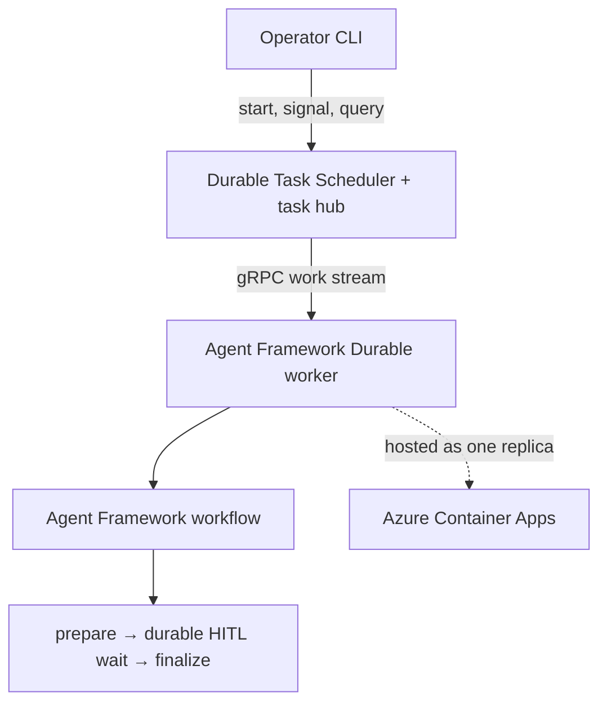

# Agent Framework durable workflow spike

## Decision

The supported durable mechanism is:

> Microsoft Agent Framework `Workflow` + Agent Framework Durable Extension (`agent-framework-durabletask`) + a standalone Durable Task worker + Durable Task Scheduler.

Host the worker on ordinary compute. Azure Container Apps is a documented and sensible target for the standalone Durable Task SDK model. It is not necessary to use Azure Functions.

Do **not** treat Foundry Hosted Agents or Foundry Agent Service session persistence as the Durable Task runtime. Foundry Hosted Agents is a separate managed container hosting option. Microsoft documents the Durable Extension as a self-managed hosting path backed by Durable Task infrastructure. A Foundry project/model is needed only when a workflow actually contains an agent that calls a Foundry-hosted model; this model-free durability spike does not need one.

Verdict: **Profile premise validated with corrections**.

The corrected premise is:

> Agent Framework workflow + Agent Framework Durable Extension + standalone Durable Task worker hosted on Azure Container Apps + Azure Durable Task Scheduler.

## Evidence classification

### Documented capability

- The Durable Extension supports Agent Framework graph workflows, durable waits, checkpoint/resume, failure recovery, and distributed stateless workers.
- It has two documented hosting models: Azure Functions and bring-your-own-compute/self-hosted.
- A self-hosted process starts a Durable Task worker, registers the Agent Framework workflow, and connects to Durable Task Scheduler.
- Durable Task Scheduler persists orchestration/entity state and history separately from the application worker.
- The Durable Task SDK provides instance state queries, full history retrieval, external events, and orchestration versioning.
- External events and activities are **at least once**. Microsoft explicitly says the application should carry a unique event ID and manually deduplicate.

### Documented implementation pattern

- `DurableAIAgentWorker.configure_workflow(workflow)` maps a named Agent Framework workflow to a Durable Task orchestration, agent entities, and non-agent activities.
- `DurableWorkflowClient` starts the workflow, reads pending HITL requests, and raises a correlated external event using the request ID.
- Microsoft provides an official standalone Python HITL workflow sample using this worker/client pattern, without Azure Functions.
- Microsoft provides an official Durable Task SDK on Azure Container Apps quickstart.

### Spike design inference

- Use one always-running Container App replica for the first Azure proof. This removes autoscaling from the foundational durability test. The documented `azure-durabletask-scheduler` KEDA scaler can be tested later.
- Run the client commands from the operator's workstation rather than deploy a second client/API container. A production self-hosted solution must expose and secure its own API or message ingress; that is intentionally outside this spike.
- Use a model-free Agent Framework workflow so the test isolates workflow durability from model availability, model cost, and Foundry configuration.
- Use a stable workflow name and strict numeric version `1.0.0`. Durable Task Scheduler requires one to three dot-separated integer components for the version. Durable Task has orchestration versioning, but breaking Agent Framework graph changes still require a deliberate side-by-side/version-aware deployment strategy.

## Component relationship

| Component | Role in this spike | Does it supply durability? |
| --- | --- | --- |
| Agent Framework `Workflow` | Defines the graph, executors, typed state, and HITL request/response | No, not by itself |
| Agent Framework workflow checkpoints | Core-framework snapshot/resume mechanism | Separate capability; not the distributed Durable Task host |
| Agent Framework Durable Extension | Adapts the workflow to Durable Task orchestrations, activities, entities, status, and external events | Enables the integration |
| Durable Task Python SDK | Worker/client programming and instance/history APIs | Implements durable execution semantics with its backend |
| Durable Task Scheduler | Managed gRPC backend, task hub, state/history store, dispatch, dashboard | Yes; this is the durable backend |
| Foundry Hosted Agents / Agent Service | Managed hosting and agent endpoint/session lifecycle | Separate hosting mechanism; not used here |
| Azure Container Apps | Runs the stateless standalone worker container | Compute host only |
| Foundry project/model | Model endpoint for agent executors | Not required for this deterministic spike |

## Spike architecture



No HTTP service is hidden in this sample. The operator CLI is a Durable Task client. Production ingress is a separate concern because the self-hosted model deliberately leaves API/authentication/lifecycle choices to the application.

## Files

- `spike.py` — workflow, standalone worker, and client/query commands.
- `pyproject.toml` — pinned beta Durable Extension and Azure Identity dependency.
- `uv.lock` — resolved Python dependency graph used by the local test.
- `Dockerfile` — non-root worker image.
- `.env.example` — configuration contract.
- `azure/deploy.sh` — provisions and deploys the Azure spike from Bash.
- `azure/cleanup.sh` — deletes only the explicitly named spike resource group.

## Shell used by this project

All command examples and automation scripts in this project use **Bash**.

- On Linux or macOS, use a normal Bash terminal.
- On Windows, use WSL or Git Bash.
- Do not paste the commands into PowerShell: Bash line continuations (`\`),
  `export`, `chmod`, and the `.sh` scripts are not PowerShell syntax.

The project does not include or require PowerShell deployment scripts.

## Configuration

| Variable | Local default | Azure value |
| --- | --- | --- |
| `ENDPOINT` | `http://localhost:8080` | Scheduler `properties.endpoint` |
| `TASKHUB` | `default` | Created task hub name |
| `WORKFLOW_VERSION` | `1.0.0` | `1.0.0`; keep stable during restart test |
| `AZURE_MANAGED_IDENTITY_CLIENT_ID` | unset | User-assigned worker identity client ID |

The local client uses anonymous emulator access. Against Azure, the workstation client uses `AzureCliCredential`; the deployed worker uses `ManagedIdentityCredential`.

## What can be proven locally

- An Agent Framework workflow is registered as a Durable Task orchestration.
- Deterministic work is checkpointed.
- The workflow enters a durable HITL wait.
- The worker can be killed while the scheduler emulator stays running.
- The same instance resumes after worker restart and an external signal.
- Runtime state, custom workflow events, output, and full orchestration history are queryable.
- Duplicate external-event behavior can be observed.

This proves worker-process restart durability against the emulator. It does not prove Azure managed-service persistence, managed identity, Azure networking, Container Apps revision lifecycle, or Azure control-plane behavior.

## Local setup

Prerequisites: Python 3.10+, `uv`, Docker, and Bash. Run these commands from
the project root:

```bash
uv sync --prerelease allow
docker rm --force dts-emulator 2>/dev/null || true
docker run --detach --name dts-emulator -p 8080:8080 -p 8082:8082 mcr.microsoft.com/dts/dts-emulator:latest
```

The pinned Agent Framework beta validates handler annotations at runtime. This
spike intentionally does not use `from __future__ import annotations`, because
that converts the `WorkflowContext[...]` annotations to strings and triggers a
known validator defect in the beta package.

The pinned Durable Extension beta also double-serializes a custom HITL request
object while routing its response back into an executor. After a worker restart,
one decode can therefore leave the request as a checkpoint-marker dictionary,
which prevents a typed response handler from matching. This spike keeps the
approval request JSON-native and explicitly registers the handler for
`dict + ApprovalSignal`. The externally supplied response and the downstream
workflow messages remain strongly typed. Remove this compatibility workaround
only after validating the behavior against a newer extension version.

The dashboard is at `http://localhost:8082`.

`WORKFLOW_VERSION` must be numeric: `1`, `1.2`, or `1.2.3`. Values such as
`spike-v1` are rejected by Durable Task Scheduler before an instance is
created. The spike defaults to `1.0.0` and validates the format before making a
scheduler call.

### Local restart/resume and duplicate test

The emulator runs detached in Docker. After starting it, use two Bash terminals
in the project directory:

- terminal 1: the long-running Python worker;
- terminal 2: the short-lived client commands.

1. Start the worker in window 1:

   ```bash
   uv run python spike.py worker
   ```

2. Start an instance in window 2 and retain the returned `instance_id`:

   ```bash
   uv run python spike.py start --instance-id local-case-001 --business-key case-001 --input-value 21
   ```

3. Wait for the durable request and retain its `request_id`:

   ```bash
   uv run python spike.py pending local-case-001
   uv run python spike.py status local-case-001
   ```

   Expected: `state.runtime_status` is `RUNNING`; custom status state is
   `waiting_for_human_input`; deterministic value `42` appears in the pending
   request. The status output also prints the endpoint, task hub, expected
   orchestration name, and version used by that terminal.

4. Terminate the worker with `Ctrl+C`. Do **not** stop the DTS emulator.

5. While the worker is down, send the identical correlated signal twice:

   ```bash
   uv run python spike.py signal local-case-001 <REQUEST_ID> --signal-id duplicate-001 --decision approve --repeat 2
   ```

   Expected: both client calls are normally accepted for durable delivery. Acceptance is not proof of deduplication.

6. Start a new worker process in window 1:

   ```bash
   uv run python spike.py worker
   ```

7. Query completion and history:

   ```bash
   uv run python spike.py wait local-case-001 --timeout 120
   uv run python spike.py status local-case-001
   uv run python spike.py history local-case-001 > local-case-001-history.json
   ```

   The `wait` command polls the workflow's persisted orchestration state once
   per second. It intentionally does not use the beta SDK's server-side wait
   RPC, which can report an immediate gRPC deadline in some DTS/emulator
   versions. If the workflow does not complete, the timeout message includes
   the last observed runtime status.

   Expected:

   - status `COMPLETED`;
   - output contains deterministic value `42`, signal ID `duplicate-001`, and one `finalize_marker`;
   - execution version is `1.0.0`;
   - history normally shows two `EventRaisedEvent` records with the same request name;
   - `finalize_activity_schedule_count` is `1`.

### If an instance is reported as not found

Run this in the same terminal as `wait`:

```bash
uv run python spike.py status local-case-001
```

- If `state` is `null`, that endpoint/task-hub combination has no such
  instance. Confirm that all terminals show the same `query.endpoint` and
  `query.taskhub`, and that the emulator container was not stopped, removed, or
  recreated. The emulator—not the Python worker—holds the local durable state.
- If `state.name` differs from
  `query.expected_orchestration_name`, the instance ID belongs to an older or
  different orchestration. Start a fresh test ID such as `local-case-002` and
  use that ID for every subsequent command.
- If the state and expected orchestration names match, the raw-state polling
  implementation continues normally; it does not depend on the beta
  `DurableWorkflowClient.get_runtime_status` ownership helper.

8. Send the same signal again after completion and preserve the result:

   ```bash
   uv run python spike.py signal local-case-001 <REQUEST_ID> --signal-id duplicate-001 --decision approve
   uv run python spike.py history local-case-001 > local-case-001-history-after-terminal-signal.json
   ```

   The service/SDK may reject a signal to a terminal instance or accept the call without changing the completed result. Either behavior is evidence to record; neither is a runtime idempotency guarantee.

### Local cleanup

```bash
docker rm --force dts-emulator
rm -f local-case-001-history*.json
```

## What must be proven in Azure

- The worker authenticates to Azure Durable Task Scheduler using its managed identity and least-privilege worker role.
- DTS state/history survives an Azure Container Apps revision restart.
- A signal sent through the Azure scheduler while the worker revision is restarting is retained and resumes the same instance.
- Scheduler dashboard and SDK history queries show the same instance and provenance.
- Container Apps-to-DTS TLS/gRPC connectivity works in the target subscription and policy environment.
- Duplicate behavior against the managed DTS service matches or differs from the emulator.

## Azure resources

The deployment script creates:

1. one resource group;
2. one Durable Task Scheduler, Consumption SKU;
3. one task hub;
4. one Azure Container Registry, Basic SKU;
5. one Container Apps environment;
6. one user-assigned managed identity;
7. one Container App worker with no ingress, one minimum/maximum replica;
8. `AcrPull` for the identity on ACR;
9. `Durable Task Worker` for the identity on the task hub;
10. `Durable Task Data Contributor` for the operator on the task hub.

The script temporarily configures the scheduler IP allow list as `0.0.0.0/0` for this spike. That is intentionally not a production network posture. A production profile must replace it with approved public ranges or a private endpoint and corresponding VNet/DNS path.

Permissions required by the deploying operator include resource creation, role assignment (`Owner` or `User Access Administrator` plus the required resource permissions), and ACR build rights.

## Azure provisioning and deployment

From a Bash terminal, authenticate first. The deployment script selects the
subscription supplied through `--subscription-id`:

```bash
az login --tenant <TENANT_ID>
az account show --output table
```

Run the script from the project root. The name prefix must be globally unique
enough for ACR, must start with a lowercase letter, and may contain only
lowercase letters and digits. Make both Bash scripts executable after extracting
the ZIP:

```bash
chmod +x azure/deploy.sh azure/cleanup.sh
./azure/deploy.sh \
  --subscription-id '<SUBSCRIPTION_ID>' \
  --name-prefix 'afdur123' \
  --location 'eastus2' \
  --operator-assignee 'you@example.com'
```

If `eastus2` is not currently supported for DTS in the subscription/cloud, the script stops and prints the provider-reported locations. Rerun with one of those locations.

Retain the JSON output. In the operator shell set the returned values:

```bash
export ENDPOINT='<ENDPOINT>'
export TASKHUB='agent-framework-spike'
export WORKFLOW_VERSION='1.0.0'
```

Do not set `AZURE_MANAGED_IDENTITY_CLIENT_ID` in the operator shell; that variable is for the deployed worker. The local client should use the current Azure CLI identity.

Verify worker startup:

```bash
az containerapp logs show \
  --resource-group '<RESOURCE_GROUP>' \
  --name '<CONTAINER_APP>' \
  --type console \
  --follow
```

Expected log: `Worker ready` with the Azure endpoint, task hub, workflow name, and `1.0.0`.

## Azure restart/resume validation

1. Start and inspect an Azure-backed instance from the workstation:

   ```bash
   uv run python spike.py start --instance-id azure-case-001 --business-key case-azure-001 --input-value 21
   uv run python spike.py pending azure-case-001
   uv run python spike.py status azure-case-001
   ```

2. Restart the active Container Apps revision:

   ```bash
   revision=$(az containerapp revision list \
     --resource-group '<RESOURCE_GROUP>' \
     --name '<CONTAINER_APP>' \
     --query '[?properties.active].name | [0]' \
     --output tsv)

   az containerapp revision restart \
     --resource-group '<RESOURCE_GROUP>' \
     --name '<CONTAINER_APP>' \
     --revision "$revision"
   ```

3. Immediately send the same signal twice while the worker is restarting:

   ```bash
   uv run python spike.py signal azure-case-001 <REQUEST_ID> --signal-id azure-duplicate-001 --decision approve --repeat 2
   ```

4. Wait for the worker to return, then query:

   ```bash
   uv run python spike.py wait azure-case-001 --timeout 180
   uv run python spike.py status azure-case-001
   uv run python spike.py history azure-case-001 > azure-case-001-history.json
   ```

5. In the Azure portal, open the Durable Task Scheduler, select the task hub, and open its dashboard. Locate `azure-case-001` and capture its status, input/output, activity timeline, raised events, and timestamps.

6. Repeat the post-completion duplicate test:

   ```bash
   uv run python spike.py signal azure-case-001 <REQUEST_ID> --signal-id azure-duplicate-001 --decision approve
   uv run python spike.py history azure-case-001 > azure-case-001-history-after-terminal-signal.json
   ```

## Success and failure evidence

### Success

All of the following should be true:

- One stable instance ID is used before and after worker restart.
- Before restart, state is `waiting_for_human_input` and contains deterministic result `42`.
- With the worker unavailable, DTS accepts/retains the signal.
- A replacement worker resumes the same instance without repeating completed workflow work.
- The instance completes with the submitted correlated signal ID.
- State query and full history reconstruct start, activities, wait, external event, resume, and completion.
- Azure dashboard corroborates the client query/history.
- Duplicate delivery does not create a second workflow completion or a second finalization schedule in this graph.
- History records the orchestration version as `1.0.0`.

### Failure

Any of these invalidates or qualifies the premise:

- Instance state disappears when the worker restarts.
- The signal is lost while the worker is unavailable.
- A different instance must be started to continue.
- The deterministic pre-wait activity is rerun as new logical work rather than replayed from history.
- The worker cannot reconnect using managed identity and the documented DTS role.
- State/history cannot establish the execution sequence.
- A duplicate signal causes duplicate non-idempotent work.
- The current beta package or documented API cannot register/resume the Agent Framework workflow in the target Azure environment.

## Idempotency conclusion

Even if this workflow finalizes only once after two same-name signals, the runtime has **not** supplied business-level idempotency. Microsoft documents external events and activities as at-least-once. A production signal envelope needs a stable `signal_id`, and the application must deduplicate before non-idempotent effects. Suitable implementations include a durable entity keyed by workflow/business key, or a transactional database record with a unique constraint/idempotency key. External side effects executed by activities must also be idempotent because activities are at-least-once.

For concurrent updates, treat the orchestration history as the single serialized command stream for one workflow instance; do not let callers directly mutate arbitrary workflow state. Concurrent external-system writes still need that system's optimistic concurrency/ETag/transaction controls. For breaking workflow changes, use explicit orchestration versions and version-aware logic, or a new stable workflow name/task hub with side-by-side workers.

## Azure cleanup

The cleanup script deletes the whole, explicitly validated spike resource group asynchronously:

```bash
./azure/cleanup.sh \
  --subscription-id '<SUBSCRIPTION_ID>' \
  --resource-group 'rg-afdur123-af-durable-spike'
```

The deletion is not recoverable through this sample. Check completion with:

```bash
az group exists --name 'rg-afdur123-af-durable-spike'
```

## Authoritative sources

- [Durable Extension for Microsoft Agent Framework](https://learn.microsoft.com/en-us/agent-framework/integrations/durable-extension)
- [Official Python standalone durable workflow/HITL samples](https://github.com/microsoft/agent-framework-durable-extension/tree/main/python/samples)
- [Official Durable Extension source](https://github.com/microsoft/agent-framework-durable-extension)
- [Choose Durable Task hosting model](https://learn.microsoft.com/en-us/azure/durable-task/common/choose-orchestration-framework)
- [Host a Durable Task SDK app on Azure Container Apps](https://learn.microsoft.com/en-us/azure/durable-task/sdks/quickstart-container-apps-durable-task-sdk)
- [Durable Task Scheduler architecture](https://learn.microsoft.com/en-us/azure/durable-task/scheduler/durable-task-scheduler)
- [External events and at-least-once delivery](https://learn.microsoft.com/en-us/azure/durable-task/common/durable-task-external-events)
- [Durable Task programming model and activity semantics](https://learn.microsoft.com/en-us/azure/durable-task/common/programming-model-overview)
- [Instance management and query APIs](https://learn.microsoft.com/en-us/azure/durable-task/common/durable-task-instance-management)
- [Orchestration versioning](https://learn.microsoft.com/en-us/azure/durable-task/common/durable-orchestration-versioning)
- [Foundry Hosted Agents](https://learn.microsoft.com/en-us/agent-framework/hosting/foundry-hosted-agent)
- [Agent Framework workflow checkpoints](https://learn.microsoft.com/en-us/agent-framework/workflows/checkpoints)
- [Microsoft-tracked postponed-annotation validator defect](https://github.com/microsoft/agent-framework/issues/3898)

Research baseline: 2026-08-10. Pinned Durable Extension source/package version: `1.0.0b260709` (beta).
